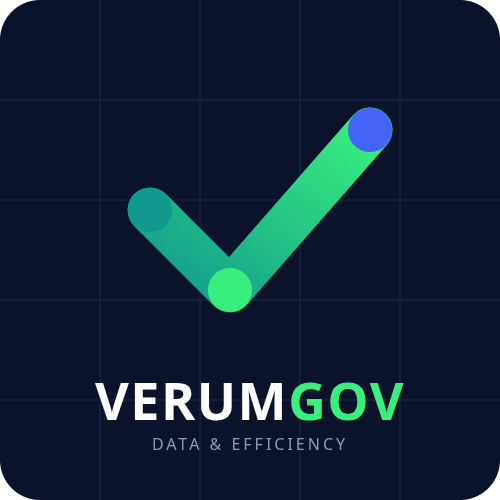

  
  <h1>VerumGov 🏛️📊</h1>
  
<b>Inteligência de Dados e Eficiência para a Gestão Pública</b>

  
  
  
  

---

## 🎯 Nossa Missão

O **VerumGov** é uma iniciativa GovTech / CivicTech de código aberto que transforma dados brutos governamentais em informações claras, acessíveis e focadas em **resultados**. 

Acreditamos que a transparência não deve servir apenas para apontar falhas, mas como uma ferramenta poderosa para **destacar a eficiência**, gerar economia aos cofres públicos e conectar a gestão ao cidadão através de entregas reais.

## 💡 Nossos Pilares (O que estamos construindo)

1. **Transparência Ativa Cidadã:** Dashboards públicos que rastreiam repasses federais e estaduais, mostrando exatamente em quais escolas, postos de saúde ou obras o dinheiro foi aplicado.
2. **Inteligência em Compras:** Cruzamento de dados com o Banco de Preços em Saúde (BPS) para identificar oportunidades de economia e premiar a eficiência em licitações.
3. **Métricas de Impacto:** Ferramentas para prefeituras e estados comunicarem suas entregas de forma visual, baseada em dados e fatos.

## 📄 Licença

Este projeto está licenciado sob a Licença MIT - veja o arquivo LICENSE para mais detalhes. Isso significa que você pode usar, copiar, modificar, mesclar, publicar e distribuir o código, inclusive para fins comerciais.

Construído com inovação para o Brasil 🇧🇷

<a href="https://verumgov.github.io">Acesse nosso site</a>

